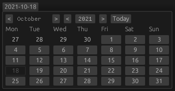

# egui-datepicker


This library provide a simple date picker widget for egui with some customization.

## ⚡️ Quickstart

Add `egui-datepicker` as dependency to your project
```toml
[dependencies]
egui-datepicker = "0.1"
```

Import necessary structs
```rust
use egui_datepicker::{DatePicker, Date, Utc};
```

or if you already include chrono in your project
```rust
use egui_datepicker::DatePicker;
use chrono::{Date, offset::Utc};
```

Add date field with selected time offset in app struct
```rust
struct MyApp {
    date: Date<Utc>,
}
```

Add widget in update function
```rust
fn update(/*snip*/) {
    /*snip*/
    ui.add(DatePicker::new("datepicker-unique-id", &mut self.date));
    /*snip*/
}
```

## ⚠️ License

`egui-datepicker` is licensed under MIT OR Apache-2.0
